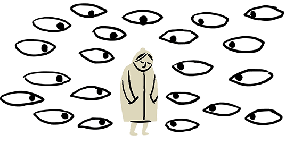
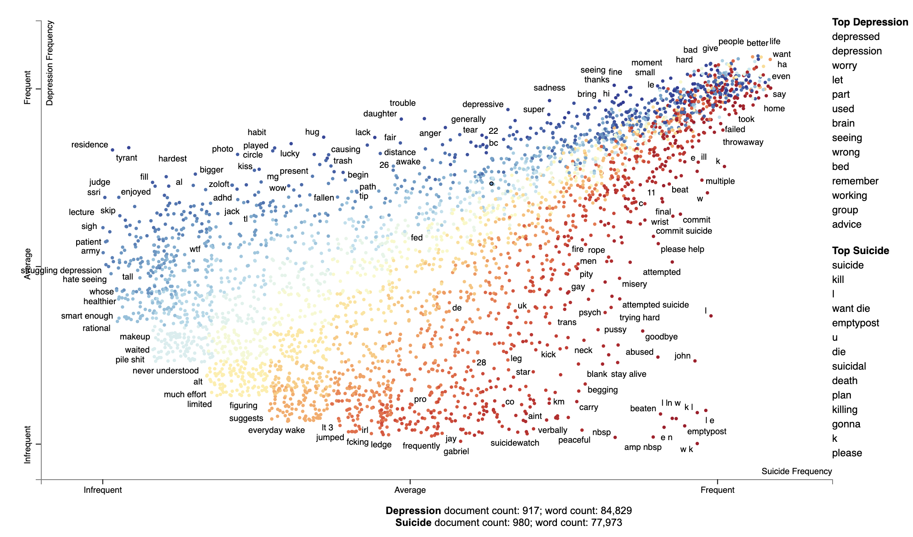
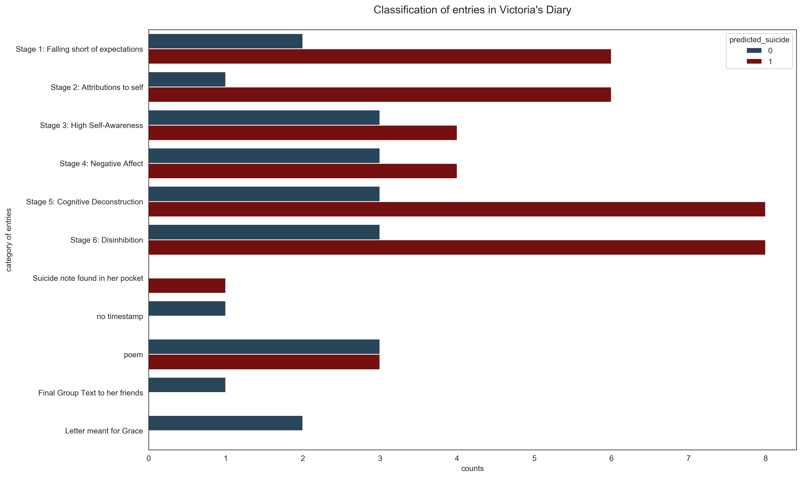

 

<h1><left>GOODBYE WORLD: using Natural Language Processing to identify suicidal posts</left></h1>
<h4><left>by Samuel He</left></h4>

___


>"*Sat in bed. Did the whole sad songs and crying bit . . . please make this sad stop. fucking make it stop.*"


Seventeen-year-old Victoria typed this into a secret diary that she kept on her laptop. Weeks later, she'd take her own life, falling ten floors from the roof of a Singapore apartment block. 

Her death is part of an alarming global statistic of 800,000 deaths from suicide every year. The World Health Organisation recommends that countries craft a national suicide prevention strategy that includes creating initiatives that aim at "early identification of groups vulnerable to the risk of suicide". 

Text-based data like the words from Victoria's diary and online suicide-aid community threads might just hold the clues to the early identification of individuals at risk of suicide.

### Seeking out Virtual Suicide Notes
A suicide note used to be the mode of final communication of a person taking his/her own life. But the rise of social media and online communities like reddit creates safe and anonymous spaces for individuals to be vulnerable and share their thoughts about their mental health and plans about taking their own lives. Our project aims to use Natural Language Processing tools to analyse text data from two support communities to learn what words are used in a *virtual suicide note*. With the help of Machine Learning classifiers, we aim to accurately identify individuals at risk of suicide.

### Two subreddits with a subtle difference
To tackle our problem statement, we needed to choose two subreddits that will yield us suitable data to identify individuals at risk. Although the majority of individuals with depression do not die from suicide, the U.S. Department of Health and Human Services states that *having major depression does increase suicide risk compared to people without depression*. 

On reddit, we found two support communities for depression and suicide. A quick read through the posts reveal the subreddits to be genuine online spaces to seek help. And thus, good forums for us to yield honest text data about people's mental state. These are our two subreddits and their *tag-lines*(which hint at their mission statements):

> **r/depression**: because nobody should be alone in a dark place

> **r/SuicideWatch**: Peer support for anyone struggling with suicidal thoughts.


Some other reasons why:

- **Active Postings** - Both subreddits have more than a hundred postings a day and responders offering their help and comments on their thoughts. 


- **Low Troll-rate** - There are few troll-posts looking to advertise products or creating "spam". 


- **Dominantly Text-based data** - Unlike other reddit threads like r/teenagers where memes dominate the conversation(and will not be useful data for a NLP project), these two subreddits have very little images posted.  


- **Same but different** - Although both subreddits are peer support forums. The language used by users posting in r/SuicideWatch seem to have more urgency, immediacy  to them. Phrases used there include: "Almost shot myself right now" and "I want to get coronavirus and die". Identifying a the difference between language used by a person with depressive thoughts and a person at risk of suicide will be useful for frontline professionals providing help to individuals, like counsellors, educators and psychiatrists.  


### Project Processes
Our journey started from Data Collection via Reddit's API (which only allows us to get approximately 1000 unique posts). Our next step was cleaning and imputing missing values in our Dataset (a fair number of users in r/SuicideWatch only wrote titles and entered no words in their posts). Using a Count Vectorizer, we analysed the most-used words from each subreddit to understand our data better(The words used were similar with some subtle differences). Using a Pipeline, we scored different classifier models like K-Nearest Neighbours and Multinomial Naive Bayes, finally settling on a final production model (TF-IDF Vectorizer + Multinomial Naive Bayes). After evaluating our results, we applied our model to exerpt's from Victoria's diary, that her parents have made available to be part of psychologist Jesse Bering's research for his book Suicidal: Why We Kill Ourselves. 

The project is organised into four notebooks:

```
GOODBYE WORLD: using Natural Language Processing to identify suicidal posts
|__ code
|   |__ 01_Data_Collection.ipynb   
|   |__ 02_Data-Cleaning_Pre-processing_EDA.ipynb   
|   |__ 03_Modelling.ipynb
|   |__ 04_Victorias_Diary.ipynb  
|__ data
|   |__ combined_data.csv
|   |__ data_for_model.csv
|   |__ data_for_model_2.csv
|   |__ depression.csv
|   |__ suicide_watch.csv
|   |__ vics_diary.csv
|__ images
|   |__ (various_images_used_for_masking)
|__ HTML_corpus.html
|__ slides.pptx
|__ README.md
```

### Data Dictionary
| Feature        | Type   | Dataset            | Description                                                                                          |
|----------------|--------|--------------------|------------------------------------------------------------------------------------------------------|
| author_clean   | object | data_for_model.csv | Cleaned usernames of redditors                                                                       |
| selftext_clean | object | data_for_model.csv | Cleaned reddit posts                                                                                 |
| title_clean    | object | data_for_model.csv | Cleaned reddit titles                                                                                |
| megatext_clean | object | data_for_model.csv | Cleaned combination of the above three columns                                                       |
| is_suicide     | int    | data_for_model.csv | Binary "target" data column indicating 1 for posts in r/SuicideWatch and 0 for posts in r/depression |
| journ_entry    | object | vics_diary.csv     | Entries from Victoria's laptop diary                                                                 |
| vic_detail     | object | vics_diary.csv     | Categories that each entry falls into. As indicated by Jesse Bering.                                 |


### Visualisations
 


> **Wanting and Feeling** - During our EDA, we analysed words in both subreddits. One interesting fact we found was that r/SuicideWatch posts used the word "Want" more than "Feel". In the r/depression subreddit, it was the other way round. You can view an interactive scattertext plot via the HTML file in our main folder. 



> **Unseen Data** - This bar plot shows the predictions made by our model on entries from Victoria's diary. If we only looked at the "pure" diaries entries (i.e. not including letters, the suicide note and poems) the model classified 70.6 percent to be in the "suicide" category. 

### Evaluation and Future Development

- **Top Words picked by TF-IDF Vectorizer** - It is important to note that the Vectorizer weighted "feel" higher than "want" although (as seen in our earlier EDA), "want" appeared more times than "feel" in suicide posts. This is probablly because TF-IDF "penalises" words that appear too much. Nonetheless, this set of words might be a good starting point to build other models that might be able to predict the presence of suicidal individuals in, say a subreddit for teachers. 


- **Double-Posting Phenomenon** - In our exploratory data analysis, we noticed more about 26 instances of individuals posting on both subreddits. The example we looked at was u/thathumbletrashcan posted on r/depression on March 4th that "*I don't want to die, but I don't want to live anymore*" . A day later, u/thathumbletrashcan visits the r/SuicideWatch forum and posts "*I've finally grown the balls to fulfil my plan......all of you won't have to deal with me again*." Social psychologist Roy Baumeister postulates in his “Suicide as Escape from Self” theory thata person descends into the pit of self-extinction in six stages. Studying double-posting through the lens of Baumeister's theory might yield links to stage-based progression amongst our redditors.


- **Looking into Male Suicides** - According to Samaritans of Singapore, males account for more than 71% of all suicides in 2018. This is consistent with our EDA findings of male-signifiers in usernames. Future projects can dive deeper into suicide amongst males. This could possibly be relevant for companies in male-dominated, high-stress industries like oil/gas, banking and tech. 


- **Complexity of Depression** - Depression is complex and layered. Future development on our model might be aided by working with someone with domain knowledge, who can help us with filtering out factors that might be linked to other conditions like self-harm/OCD/Anxiety?

### References

- **Gender Differences in Suicide.** Wikipedia, Wikimedia Foundation, 9 Feb. 2020, https://en.wikipedia.org/wiki/Gender_differences_in_suicide.


- **Learn about Suicide- Quick Facts.** Samaritans of Singapore, 10 March. 2020,
https://www.sos.org.sg/learn-about-suicide/quick-facts


- **Swanson, Barrett. “The Two Faces of Suicide.”** The New Yorker, The New Yorker, 17 Jan. 2019, www.newyorker.com/books/under-review/the-two-faces-of-suicide.\


- **Preventing Suicide: a Global Imperative.** World Health Organization, 2014.


- **U.S. Department of Health & Human Services. “Does Depression Increase the Risk for Suicide?”** HHS.gov, 21 Aug. 2015, www.hhs.gov/answers/mental-health-and-substance-abuse/does-depression-increase-risk-of-suicide/index.html.


- **Bering, Jesse. Suicidal: Why We Kill Ourselves.** The University of Chicago Press, 2018.
